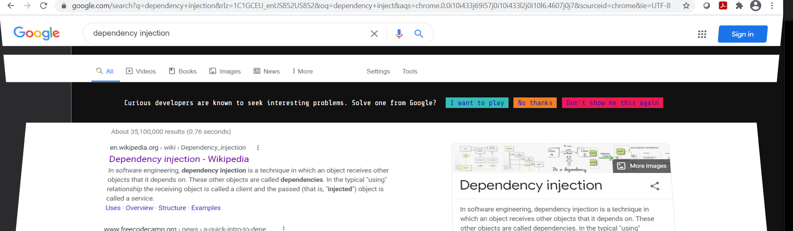

# Google Foobar Challenge

This is all the code I wrote for the (top secret 😮) Google Foobar recruitment challenge, in a pile, no sensible structure lives here.
Each challenge level got a directory and each task in the level got a subdirectory, after that its a

## What?

In February, I was in a meeting and my boss at the time, used the term 'Dependency Injection' in a way I wasn't sure was correct. 
I googled it, and the page split open and displayed this message:
"Curious Developers are known to seek interesting problems. Solve one from Google?"

Apparently, Google triggers this challenge based on your search history if they think you're someone who is a "curious developer" but, as far as I can tell, nobody is really sure exactly what type of searches will trigger the prompt.

Then you're taken to a small linux-style shell environment, where you dig through some text files where you find the first challenge. You can submit answers to each challenge in Java or Python (I chose Python for all of them because I typically prefer scripting languages for most tasks)

I got far enough my results where sent to a google recruiter, but my github was mostly empty and my linked in didn't exist
(I was pushing code to a local gitea instance hosted on a raspberry pi at the time... for fun) 

But, in the end I wasn't looking for a new job anyway, I was just happy to be invited, and overall I consider the experience a huge success.

## Lessons Learned
- Everything in version control, all the time.
    - Each challenge had a time limit, and in 'crunch time' I didn't use any branching strategy and that resulted in unintelligble python soup in each of the folders. You have to look real close to see the path I took to the solutions and I had a hard time keeping track of what my most recent revisions where.
    - Migrating repos is trivial, with a few commands I was able to take what I had on gitea, change the remote, and push to my official github.
- Docker as a lab space
    - I may have been going overboard, and I'm sure there's a more straight forward way to do this with python on its own, but to make sure the python version that was allowed and what I was using matched exactly, I would use a python docker image and aliased the run command so I could mount a script in a container, run it and print results, like I would normally but it would execute in the docker environment.
- Python [List Comprehension](https://www.w3schools.com/python/python_lists_comprehension.asp) is super neat and I wish other languages implemented it 
