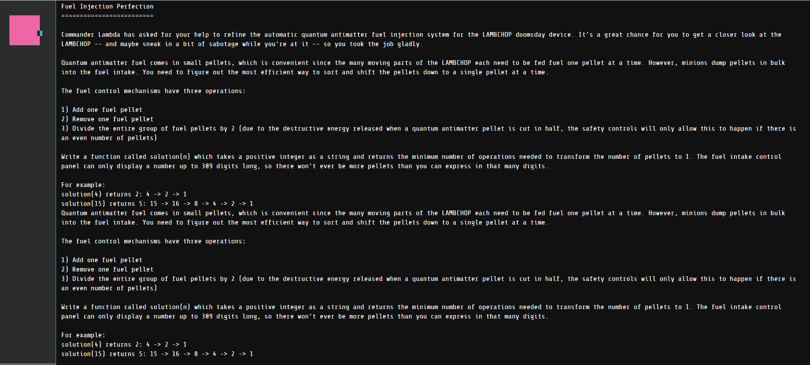

# fuel-injection-perfection

This one was interesting because it required an optimized version of dijkstras shortest path.
The trick was use a priority queue implementation like [this one](https://en.wikipedia.org/wiki/Dijkstra%27s_algorithm#Using_a_priority_queue) and pay attention to the details in [this post](https://cs.stackexchange.com/questions/118388/dijkstra-without-decrease-key)